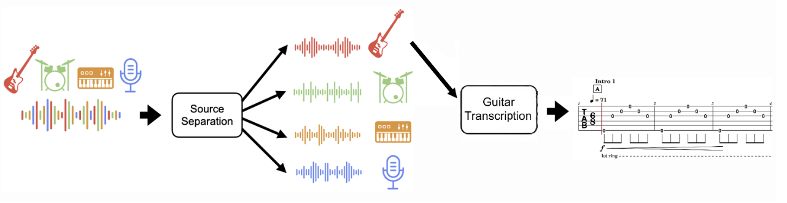

# Automatic Tablature Extraction
Master's thesis at Warsaw University of Technology.
Topic: Music Source Separation and Automatic Music Transcription using Artificial Intelligence methods.

This topic is devoted to the problem of generating guitar tablature from song recordings. It's related to two Music Information Retrieval fields: Music Source Separation and Automatic Music Transcription.



## REPO structure

```
automatic_tablature_extraction/
├── BandSplitRNN/                # Submodule: BandSplitRNN source separation
├── DTTNetPytorch/               # Submodule: DTTNet source separation
├── MSS_Training/                # Submodule: Music Source Separation training
├── music_transcription/         # Submodule: Music transcription
├── tablature_extraction/        # Main pipeline and orchestration code
│   ├── pipeline.py              # Main pipeline script
│   ├── source_separation.py     # Source separation hub
│   ├── transcription.py         # Transcription hub
│   ├── demo.py                  # Gradio demo
│   └── ...
├── configs/                     # Model configs
├── data/                        # Datasets, results, and test audio
│   ├── guitarset/
│   ├── musdb18/
│   ├── results/
│   ├── example.wav
│   └── example2.wav
├── models/                      # Model checkpoints
├── patches/                     # Patch files for submodules
├── tests/                       # Unit tests
├── README.md
├── apply_patches.sh
├── pixi.lock                    
├── pixi.toml                    # Pixi environment definition
└── ...
```

# Submodules

Some dependencies are included as git submodules. To initialize and update all submodules, run:

```bash
git submodule update --init --recursive
```

This will ensure all required submodule code is present before applying patches or running the pipeline.
Submodules require patching for compatibility. To apply all patches, run:

```bash
sh apply_patches.sh
```

This will apply all patches in the `patches/` directory to their respective submodules. (See `apply_patches.sh` for details.)


# Downloading Checkpoints
DTTNet model checkpoints can be downloaded from https://mega.nz/folder/E4c1QD7Z#OkgM_dEK1tC5MzpqEBuxvQ and should be unzipped into models/dtt/.

BSRNN model checkpoint for the 'other' stem can be downloaded from https://huggingface.co/crlandsc/bsrnn-other/tree/main and should be placed in BandSplitRNN/src/saved_models/other/

Some models were trained by the community and shared via https://github.com/ZFTurbo/Music-Source-Separation-Training/blob/main/docs/pretrained_models.md. Downloaded checkpoints should be placed in the models/ directory.


# Training Models
CRNN has been trained using the music_transcription repo.
After training the model following instructions, copy best_model.pth to the models/ directory and name it as model_crnn.pth. Also copy the configuration file and place it in the same directory.

# Environment Setup

This project uses [pixi](https://pixi.prefix.dev/latest/) for reproducible Python environments. To initialize the environment, run:

```bash
pixi install
```

To activate a shell with the project environment, run:

```bash
pixi shell
```

**Important:** Set the following environment variable to avoid legacy sklearn install failures:

```bash
export SKLEARN_ALLOW_DEPRECATED_SKLEARN_PACKAGE_INSTALL=True
```

This ensures all dependencies are installed and the environment is ready for use. All scripts should be run in the pixi environment from the root directory.


# Example Run:
```bash
python -m tablature_extraction.pipeline --separation_model open_unmix --transcription_model basic_pitch --audio data/example.wav
```


# Gradio Demo
As part of the thesis, a GUI for end-to-end separation and transcription was prepared using Gradio.
```bash
python -m tablature_extraction.demo
```


# Evaluation

Evaluation of separation models was conducted on the MUSDB18 dataset—specifically a subset derived from MedleyDB (18 songs).
Original files are stored as .mp4. To create wav files, follow instructions in https://github.com/sigsep/sigsep-mus-db. Especially:
```bash
musdbconvert data/musdb18 data/musdb18/wav
```
```bash
python -m tablature_extraction.eval_source_separation
```

Evaluation of transcription models was conducted on the GuitarSet dataset. It can be downloaded from https://guitarset.weebly.com. Unpacked directories should be stored in the data/guitarset directory.
```bash
python -m tablature_extraction.eval_transcription
```

## Source Separation Results

| Model              | SDR      | SIR      | ISR      |
|--------------------|----------|----------|----------|
| bs_roformer        | 10.70    | 17.28    | 10.45    |
| scnet              | 9.83     | 15.55    | 9.56     |
| dttnet             | 9.75     | 16.07    | 9.52     |
| mel_band_roformer  | 9.48     | 15.67    | 9.31     |
| ht_demucs_ft       | 7.73     | 13.18    | 7.29     |
| hybrid_demucs      | 7.58     | 12.75    | 7.16     |
| ht_demucs          | 7.37     | 12.60    | 6.86     |
| ht_demucs_guitar   | 6.79     | 12.01    | 6.19     |
| bandsplitrnn       | 2.60     | 6.13     | 1.47     |
| open_unmix         | -5.41    | -2.49    | 4.12     |

## Transcription Results

| Model        | TDR   | Tab Precision | Tab Recall | Tab F1 | Onset Precision | Onset Recall | Onset F1 | MPE Precision | MPE Recall | MPE F1 |
|--------------|-------|---------------|------------|--------|-----------------|--------------|----------|---------------|------------|--------|
| basic_pitch  | 0.35  | 0.0115        | 0.0117     | 0.0112 | 0.183           | 0.186        | 0.178    | 0.0061        | 0.0231     | 0.0090 |
| crnn         | 0.83  | 0.454         | 0.537      | 0.490  | 0.938           | 0.758        | 0.824    | 0.724         | 0.690      | 0.705  |


# Unit Tests
Run with:
```bash
python -m pytest tests/
```
