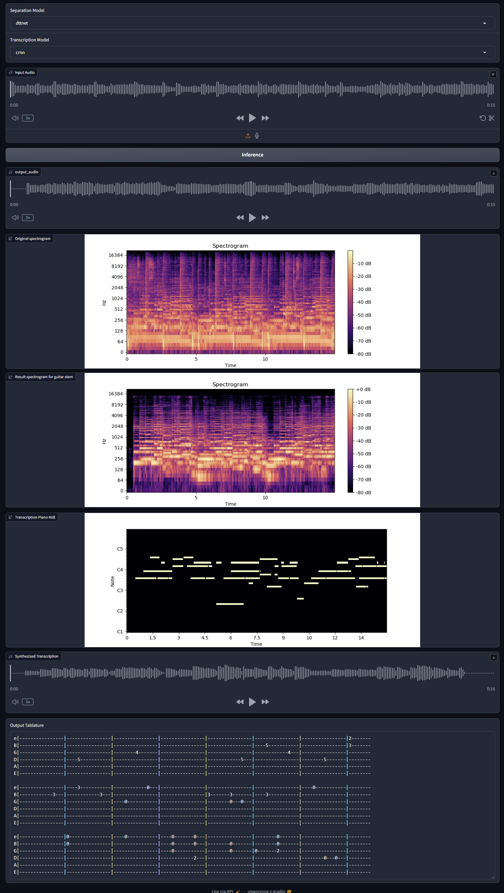

# Automatic tablature extraction
Master's thesis at Warsaw Univerity of Technology.
Topic: Music Source Separation and Auomatic Music Transciption using Artificial Intelligence methods.

Topic is devoted into problem of generating guitar tablature from songs recordings. It's related to two Music Information Retrieval fields: Music Source Separation and Automatic Music Trascription.

## REPO structure

```
automatic_tablature_extraction/
├── BandSplitRNN/                # Submodule: BandSplitRNN source separation
├── DTTNetPytorch/               # Submodule: DTTNet source separation
├── MSS_Training/                # Submodule: Music Source Separation training
├── music_transcription/         # Submodule: Music transcription
├── tablature_extraction/        # Main pipeline and orchestration code
│   ├── pipeline.py              # Main pipeline script
│   ├── source_separation.py     # Source separation hub
│   ├── transcription.py         # Transcription hub
│   ├── demo.py                  # Gradio demo
│   └── ...
├── configs/                     # Model configs
├── data/                        # Datasets, results, and test audio
│   ├── guitarset/
│   ├── musdb18/
│   ├── results/
│   ├── example.wav
│   └── example2.wav
├── models/                      # Model checkpoints
├── patches/                     # Patch files for submodules
├── tests/                       # Unit tests
├── README.md
├── apply_patches.sh
├── pixi.lock                    
├── pixi.toml                    # Pixi environment definition
└── ...
```

# Submodules

Some dependencies are included as git submodules. To initialize and update all submodules, run:

```bash
git submodule update --init --recursive
```

This will ensure all required submodule code is present before applying patches or running the pipeline.
Submodules require patching for compatibility. To apply all patches, run:

```bash
sh apply_patches.sh
```

This will apply all patches in the `patches/` directory to their respective submodules. (See `apply_patches.sh` for details.)

# Downloading checkpoints
DTTNet model checkpoints can be downloaded from https://mega.nz/folder/E4c1QD7Z#OkgM_dEK1tC5MzpqEBuxvQ and should be unzipped to in models/dtt/.

BSRNN model checkpoit for other stem can be downloaded from https://huggingface.co/crlandsc/bsrnn-other/tree/main and should be placed in BandSplitRNN/src/saved_models/other/

Some models were trained by community and shared via https://github.com/ZFTurbo/Music-Source-Separation-Training/blob/main/docs/pretrained_models.md. Downloaded checkpoints should be placed in models/ dir.


# Training models
CRNN has been trained using music_transcription repo.
After training model following isntructions, copy best_model.pth to models/dir and name it as model_crnn.pth. Also copy configuration file and place it in the same directory.

# Environment Setup

This project uses [pixi](https://prefix.dev/docs/pixi/) for reproducible Python environments. To initialize the environment, run:

```bash
pixi install
```

To activate a shell with the project environment, run:

```bash
pixi shell
```

**Important:** Set the following environment variable to avoid legacy sklearn install failures:

```bash
export SKLEARN_ALLOW_DEPRECATED_SKLEARN_PACKAGE_INSTALL=True
```

This ensures all dependencies are installed and the environment is ready for use. All scripts should be run in pixi env from root directory.


# Example run:
```bash
python -m tablature_extraction.pipeline --separation_model open_unmix --transcription_model basic_pitch --audio data/example.wav 
```

# Gradio demo
As part of thesis an GUI for end-to-end separation adn transcription was prepared using Gradio.
```bash
python -m tablature_extraction.demo
```


# Evaluation
Evaluation of separation models were conducted on MUSDB18 dataset - specifically a subset that was derived from MedleyDB (18 songs).
Original files are stores as .mp4 to create wav files follow isntruction in https://github.com/sigsep/sigsep-mus-db. Especially
```bash
musdbconvert data/musdb18 data/musdb18/wav
```
```bash
python -m tablature_extraction.eval_source_separation
```

Evaluation of transcription models were conducted on GuitarSet dataset. It can be downloaded from https://guitarset.weebly.com. Unpacked directories should be stored in data/guitarset directory.
```bash
python -m tablature_extraction.eval_transcription
```

# Unit Tests
Run with
```bash
python -m pytest tests/
```
